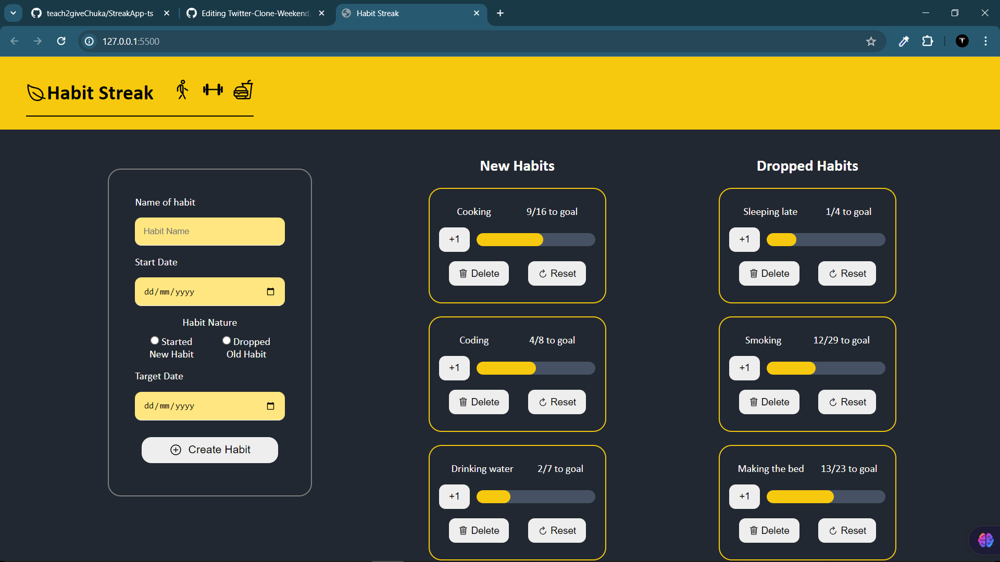

# Habit Tracker Application -TYPESCRIPT


A simple habit tracker application that allows users to add, track, and delete habits. The application is built using TypeScript and utilizes JSON Server to simulate a backend API for data storage.

### Screenshot


## Features

- **Add Habits**: Users can add new habits with a name, start date, end date, and type (good or bad).
- **Track Progress**: Users can increment progress towards habit goals.
- **Delete Habits**: Users can delete habits.
- **Reset Progress**: Users can reset the progress of a habit.

## Getting Started

### Prerequisites

- Node.js
- npm (Node Package Manager)

### Installation

1. **Clone the repository:**
    ```sh
    git clone https://github.com/teach2giveChuka/StreakApp-ts

    cd habit-tracker
    ```

2. **Install dependencies:**
    ```sh
    npm install
    ```

3. **Start the JSON Server:**
    ```sh
    json-server --watch db.json --port 3000
    ```

4. **Open the application:**
    Open `index.html` in your web browser.

## Project Structure

- `index.html`: The main HTML file.
- `styles.css`: The CSS file for styling the application.
- `main.ts`: The TypeScript file containing the application logic.
- `db.json`: The JSON file used by JSON Server to simulate a backend.

## Usage

- **Adding a Habit**: Fill out the form with the habit details and click "Add Habit".
- **Incrementing Progress**: Click the "+1" button next to a habit to increment its progress.
- **Deleting a Habit**: Click the "Delete" button next to a habit to remove it.
- **Resetting Progress**: Click the "Reset" button next to a habit to reset its progress to zero.

## Example Data Structure

```json
{
  "streakData": [
    {
      "id": 1716500216617,
      "name": "Example Habit",
      "startDate": "2024-05-01",
      "endDate": "2024-05-15",
      "type": "good",
      "progress": 0,
      "goal": 14
    }
  ]
}
